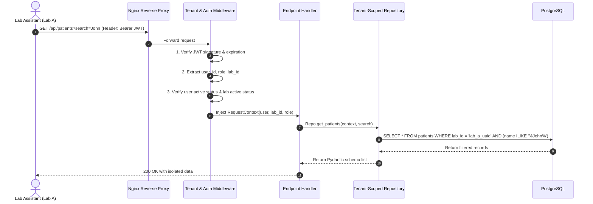
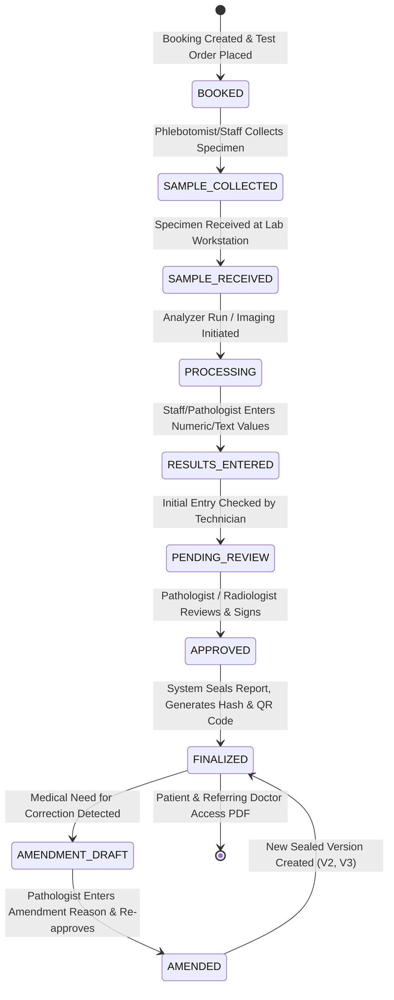

# DiagnoLab – Multi-Tenant Diagnostic Laboratory Management System
## System Architecture & Technical Design Document

---

## 1. Executive Summary & Architectural Goals

**DiagnoLab** is an enterprise-grade, cloud-native, multi-tenant Software-as-a-Service (SaaS) Diagnostic Laboratory Information and Management Portal. It enables multiple autonomous diagnostic laboratories, imaging centers, and pathology clinics to operate independently on a unified platform with strict cryptographic and database-level isolation.

### Core Architectural Pillars
1. **Absolute Multi-Tenant Isolation**: Row-level tenancy enforced via cryptographically verified JWT claims, database filters, and tenant-scoped repository patterns. Zero cross-tenant data leakage.
2. **Defensive Medical Workflow Integrity**: Immutable finalized reports, strict versioning with audit trail, electronic approvals by authorized medical officers, and tamper-resistant QR-based verification.
3. **Medical Safety Distinction**: The platform explicitly provides laboratory workflow tracking, numeric range classification (LOW, NORMAL, HIGH, CRITICAL, ABNORMAL), and reporting templates. It intentionally **does not automate clinical diagnoses**. Medical interpretation is strictly reserved for authenticated Pathologists and Radiologists.
4. **Resilient Document & Asset Generation**: Fast, deterministic PDF generation for clinical reports and tax-compliant invoices, supporting dynamic lab branding, digital signatures, and secure download tokens.
5. **Modern Reactive UI**: Designed using React 18+, TypeScript, Tailwind CSS, TanStack Query, and Lucide icons with role-adaptive dashboards for Super Admins, Lab Personnel, and Patients.

---

## 2. High-Level System Architecture

```mermaid
flowchart TD
    subgraph Clients["Client Layer (Desktop, Tablet, Mobile)"]
        SA_UI["Super Admin Dashboard"]
        LA_UI["Lab Admin / Staff Portal"]
        PT_UI["Patient Self-Service Portal"]
        QR_UI["Public QR Verification Portal"]
    end

    subgraph Gateway["Edge / Reverse Proxy Layer"]
        NGINX["Nginx Reverse Proxy & SSL Termination\n(Rate Limiting, Security Headers, Gzip)"]
    end

    subgraph AppServer["Application Layer (FastAPI / Python 3.12)"]
        AUTH_MW["Auth & Tenant Context Middleware"]
        RBAC_GUARD["RBAC & Permission Evaluator"]
        
        subgraph APIRoutes["REST API Endpoints"]
            AUTH_API["Auth & Session API"]
            TENANT_API["Laboratory & Tenant API"]
            PATIENT_API["Patient Management API"]
            BOOKING_API["Bookings & Invoicing API"]
            SAMPLE_API["Sample Tracking API"]
            TEST_API["Test & Parameter Catalog API"]
            RESULT_API["Result Entry & Review API"]
            REPORT_API["Report & Versioning API"]
            DOC_API["PDF Generation & Document Storage"]
            AUDIT_API["Audit Logging API"]
        end

        subgraph CoreServices["Domain Services Layer"]
            TENANT_SVC["Tenant Isolation Service"]
            CALC_SVC["Reference Range & Status Engine"]
            PDF_SVC["ReportLab / Headless PDF Engine"]
            QR_SVC["HMAC Verification & QR Engine"]
            AUDIT_SVC["Structured Audit Logger"]
        end
    end

    subgraph DataLayer["Persistence & Storage Layer"]
        PG[("PostgreSQL 16\n(Multi-tenant Relational DB)")]
        STORAGE[("Storage Provider Abstraction\n(Local Disk Dev / AWS S3 Prod)")]
    end

    Clients -->|HTTPS / WSS| NGINX
    NGINX -->|Reverse Proxy /api| AUTH_MW
    AUTH_MW --> RBAC_GUARD
    RBAC_GUARD --> APIRoutes
    APIRoutes --> CoreServices
    CoreServices --> PG
    CoreServices --> STORAGE
```



---

## 3. Multi-Tenancy Architecture

### 3.1 Tenancy Isolation Model: Pooled Database with Logical Partitioning
DiagnoLab employs a **Pooled Database with Logical Partitioning** model, which is the gold standard for high-density, multi-tenant healthcare SaaS:
- Every tenant entity table possesses a strictly indexed, foreign-keyed `lab_id` column.
- The `SUPER_ADMIN` operates across the global plane (`lab_id = NULL` or tenant bypass with full platform oversight).
- All laboratory staff (`LAB_ADMIN`, `LAB_ASSISTANT`, `PATHOLOGIST`, `RADIOLOGIST`, `RECEPTIONIST`) are anchored to exactly one laboratory (`lab_id`).
- Patients possess an account that can correlate with one or more labs via patient profiles, while their medical bookings and reports remain strictly isolated within the ordering lab's boundary.

### 3.2 Tenant Context Lifecycle in FastAPI


### 3.3 Anti-Spoofing & Tamper Protections
1. **No Frontend Tenancy Reliance**: The `lab_id` is never read from client query params or request bodies for tenant users; it is resolved strictly from the verified, cryptographically signed server-side session/JWT.
2. **Cross-Tenant Attack Rejection**: If a user from Lab B explicitly specifies an ID belonging to Lab A (`GET /api/bookings/BK-LAB-A-001`), the query resolves `WHERE id = :id AND lab_id = :user_lab_id`, immediately triggering a `404 Not Found` or `403 Forbidden`. No existence leak occurs.

---

## 4. Role-Based Access Control (RBAC) Architecture

The platform implements hierarchical RBAC with fine-grained capability checks:

| Role | Scope | Key Capabilities |
| :--- | :--- | :--- |
| **SUPER_ADMIN** | Platform Global | Create/suspend labs, global master test catalog, billing plans, platform analytics, system settings, cross-lab audit trails. |
| **LAB_ADMIN** | Tenant Specific | Lab profile, branding, custom test pricing, staff management, reference range overrides, lab invoices, lab audit logs. |
| **LAB_ASSISTANT** | Tenant Specific | Patient registration, booking creation, sample accessioning & status update, barcode assignment, draft result entry. |
| **PATHOLOGIST** | Tenant Specific | Biochemistry/Pathology result entry, parameter review, flag validation, medical verification, digital signature approval. |
| **RADIOLOGIST** | Tenant Specific | Imaging study review (X-ray, Ultrasound), DICOM/image attachment, rich-text findings & impression authoring, imaging report approval. |
| **RECEPTIONIST** | Tenant Specific | Patient intake, appointment scheduling, billing, payment processing (Cash, Card, UPI), receipt printing. |
| **PATIENT** | Individual Records | Access self-service portal, view personal bookings, download verified final reports, download invoices/receipts. |

---

## 5. Medical Workflow & Report Lifecycle State Machine



### 5.1 Report Immutability & Versioning Rules
- **Sealing Rule**: Once a report reaches `FINALIZED`, the database record is flagged as `is_immutable = TRUE`. Any SQL `UPDATE` attempt is rejected at both application service and repository layers.
- **Amendment Rule**: To alter a finalized report, the Pathologist must invoke an explicit `/amend` endpoint requiring an authenticated `amendment_reason`. The system generates a child `report_versions` record with incremented version (`v2.0`), preserving previous versions for historical and legal audit compliance.

---

## 6. Document Generation & Storage Abstraction

### 6.1 Diagnostic Report PDF Generation Engine
- Built with Python's industrial-grade **ReportLab Flowables & Platypus engine**.
- Features:
  - Header: Dynamic Lab Logo, Accreditation Badges (NABL/CAP placeholder), Lab Contact Info, Unique Barcode/QR.
  - Patient Meta Grid: Name, Age/Gender, Patient ID, Sample ID, Ordering Doctor, Collection Time, Report Time.
  - Parameter Matrix: Two-level hierarchy (Category/Test -> Sub-parameters) with columns for Test Name, Observed Value, Units, Biological Reference Intervals, and Visual Flags (`HIGH`, `LOW`, `CRITICAL`).
  - Imaging Findings: Formatted sections for Clinical Indication, Technique, Findings, Impression, and Recommendations.
  - Medical Legal Signature Block: Pathologist/Radiologist Name, Degree, Registration Number, and Cryptographic Digital Signature Timestamp.
  - Footer: Microtext disclaimer, verification URL, Page X of Y pagination.

### 6.2 Storage Abstraction Interface
```python
class IStorageProvider(ABC):
    @abstractmethod
    async def upload_file(self, file_bytes: bytes, destination_path: str, content_type: str) -> str: ...
    
    @abstractmethod
    async def get_file_stream(self, file_path: str) -> Tuple[BinaryIO, str]: ...
    
    @abstractmethod
    async def delete_file(self, file_path: str) -> bool: ...
```
- **Development**: Local disk storage mounted in sandboxed volumes with directory hashing (`/uploads/{lab_id}/{entity_type}/{year}/{month}/{file_uuid}.pdf`).
- **Production**: Seamless drop-in adapter for AWS S3 / MinIO / Google Cloud Storage with private buckets and time-limited presigned download URLs.

---

## 7. Tamper-Resilient QR Code & Verification Architecture

1. When a report is finalized, the system computes a SHA-256 integrity hash of the critical clinical payload:
   $$\text{Hash} = \text{HMAC-SHA256}(\text{ReportID} + \text{PatientID} + \text{LabID} + \text{ApprovalTimestamp} + \text{Salt})$$
2. A unique short verification token (`uuid4` or cryptographic slug) is generated and mapped to this snapshot.
3. The QR code embedded in the PDF links to:
   `https://diagnolab.domain/verify/{verification_token}`
4. **Public Verification Page**:
   - Displays masked patient name (e.g., `J*** D**`), Age/Gender, Lab Name, Test List, Final Approval Timestamp, and "VERIFIED AUTHENTIC" badge.
   - Prevents medical identity theft while allowing doctors, airlines, or insurance companies to confirm report authenticity.

---

## 8. Audit Logging & Compliance Infrastructure

Every state mutation in DiagnoLab emits a structured audit record:
- **Timestamp**: High-precision UTC timestamp.
- **Actor**: `user_id`, `user_email`, `user_role`.
- **Tenant**: `lab_id`, `lab_name`.
- **Action**: e.g., `PATIENT_REGISTERED`, `SPECIMEN_REJECTED`, `RESULT_SAVED`, `REPORT_FINALIZED`, `REPORT_AMENDED`.
- **Target Entity**: Entity Name (`bookings`, `reports`, `invoices`) & Primary Key UUID.
- **Client Metadata**: Client IP, User-Agent, Session ID.
- **State Diff**: Sanitized JSON delta (excluding sensitive passwords/tokens) recording previous state and new state.

---

## 9. Technology Stack Architecture

### Frontend
- **Framework**: React 18 with TypeScript and Vite for ultra-fast HMR and optimized tree-shaken bundles.
- **UI & Styling**: Tailwind CSS, Shadcn/UI design patterns, Lucide React icons, Radix UI primitives for full WAI-ARIA accessibility.
- **State & Data Fetching**: TanStack Query (React Query v5) for optimistic updates, cache invalidation, and automatic background refetching.
- **Forms & Validation**: React Hook Form coupled with Zod runtime schemas for frictionless form validation.
- **Data Visualization**: Recharts for responsive SVG-based business intelligence charts (revenue, turnaround times, sample volumes).

### Backend
- **Runtime & Web Framework**: Python 3.12+ with FastAPI (asynchronous, high-throughput ASGI architecture).
- **ORM & Data Layer**: SQLAlchemy 2.0 (async-ready declarative mappings with strict type annotations).
- **Database Migrations**: Alembic for version-controlled, reproducible schema migrations.
- **Validation & Serialization**: Pydantic v2 (compiled Rust core for 10x faster serialization).
- **Security & Crypto**: Passlib/Bcrypt for salt-hashed password storage; PyJWT for asymmetric or symmetric HS256/RS256 token verification.

---

## 10. DevOps & Production Readiness

- **Containerization**: Multi-stage Dockerfiles for frontend (Node build -> Nginx alpine) and backend (Python 3.12 slim with non-root security user).
- **Orchestration**: Docker Compose coordinating PostgreSQL 16, Backend API, Frontend Web, and Nginx reverse proxy.
- **Security Headers**: HSTS, Content-Security-Policy, X-Frame-Options: DENY, X-Content-Type-Options: nosniff.
- **Zero-Downtime Migration Support**: Alembic pre-start checks to verify schema alignment before launching web workers.
