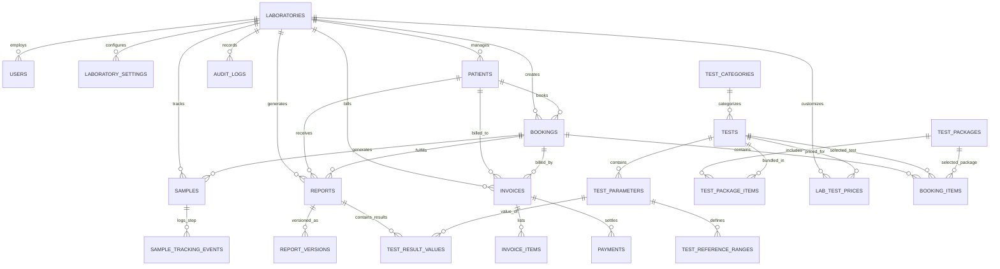

# DiagnoLab – Database Schema & Architecture Specification
## Relational Data Modeling for Multi-Tenant Diagnostic Healthcare

---

## 1. Relational Philosophy & Design Standards

1. **Primary Keys**: UUID v4 (`uuid_generate_v4()` in PostgreSQL / Python `uuid.uuid4`) for all major business entities to prevent enumeration attacks and simplify distributed replication. Sequential human-readable identifiers (e.g., `BK-2026-000001`, `SMP-2026-000001`, `PAT-2026-000001`, `REP-2026-000001`) are maintained as separate unique indexed columns for user-facing interactions.
2. **Multi-Tenant Scoping**: All tenant-owned records have `lab_id UUID NOT NULL REFERENCES laboratories(id) ON DELETE RESTRICT`. Composite indexes `(lab_id, created_at DESC)` and `(lab_id, status)` ensure rapid indexed lookups within the tenant partition.
3. **Financial Precision**: All monetary values (`price`, `discount_amount`, `tax_amount`, `subtotal`, `grand_total`, `paid_amount`, `balance_amount`) utilize `NUMERIC(12, 2)` to eliminate floating-point rounding errors.
4. **Auditability & Soft Deletion**:
   - `created_at TIMESTAMPTZ NOT NULL DEFAULT CURRENT_TIMESTAMP`
   - `updated_at TIMESTAMPTZ NOT NULL DEFAULT CURRENT_TIMESTAMP`
   - `deleted_at TIMESTAMPTZ NULL` (for soft-deleted records like inactive tests or archived patients).
5. **No AI Diagnostic Claims**: Tables store raw technician readings, parameter reference ranges, and system flags (`LOW`, `NORMAL`, `HIGH`, `CRITICAL`), never clinical assertions.

---

## 2. Entity Relationship Diagram (ERD)



---

## 3. Table Definitions & Schemas

### 3.1 Platform & Laboratory Tenancy

#### `laboratories`
Master registry for all diagnostic laboratories onboarded to the SaaS platform.
```sql
CREATE TABLE laboratories (
    id UUID PRIMARY KEY DEFAULT gen_random_uuid(),
    code VARCHAR(32) NOT NULL UNIQUE,              -- e.g. "LAB-METRO"
    name VARCHAR(255) NOT NULL,
    legal_name VARCHAR(255),
    registration_number VARCHAR(100),              -- Clinical Establishment Reg No.
    tax_identifier VARCHAR(100),                   -- GSTIN / VAT / EIN
    email VARCHAR(255) NOT NULL,
    phone VARCHAR(32) NOT NULL,
    website VARCHAR(255),
    address_street TEXT NOT NULL,
    city VARCHAR(100) NOT NULL,
    state VARCHAR(100) NOT NULL,
    postal_code VARCHAR(20) NOT NULL,
    country VARCHAR(100) DEFAULT 'India',
    logo_url TEXT,
    is_active BOOLEAN NOT NULL DEFAULT TRUE,
    subscription_plan VARCHAR(50) DEFAULT 'STANDARD', -- 'STARTER', 'STANDARD', 'ENTERPRISE'
    subscription_expires_at TIMESTAMPTZ,
    created_at TIMESTAMPTZ NOT NULL DEFAULT CURRENT_TIMESTAMP,
    updated_at TIMESTAMPTZ NOT NULL DEFAULT CURRENT_TIMESTAMP,
    deleted_at TIMESTAMPTZ NULL
);
CREATE INDEX idx_laboratories_active ON laboratories(is_active);
```

#### `laboratory_settings`
Branding, report formatting, invoice templates, and accreditation configs.
```sql
CREATE TABLE laboratory_settings (
    id UUID PRIMARY KEY DEFAULT gen_random_uuid(),
    lab_id UUID NOT NULL UNIQUE REFERENCES laboratories(id) ON DELETE CASCADE,
    report_header_html TEXT,
    report_footer_html TEXT,
    report_disclaimer TEXT DEFAULT 'This is an electronically generated and authenticated diagnostic report. No physical signature is required. Results relate only to the specimen tested.',
    currency_code VARCHAR(10) DEFAULT 'INR',
    currency_symbol VARCHAR(5) DEFAULT '₹',
    default_tax_rate NUMERIC(5, 2) DEFAULT 0.00,  -- percentage (e.g. 5.00 for 5%)
    enable_qr_verification BOOLEAN DEFAULT TRUE,
    primary_color_hex VARCHAR(7) DEFAULT '#0284c7',
    secondary_color_hex VARCHAR(7) DEFAULT '#0f172a',
    default_signatory_name VARCHAR(150),
    default_signatory_designation VARCHAR(150),   -- 'Chief Consultant Pathologist'
    default_signatory_degrees VARCHAR(150),       -- 'MD (Pathology), DCP'
    default_signatory_reg_no VARCHAR(100),
    default_signatory_signature_url TEXT,
    created_at TIMESTAMPTZ NOT NULL DEFAULT CURRENT_TIMESTAMP,
    updated_at TIMESTAMPTZ NOT NULL DEFAULT CURRENT_TIMESTAMP
);
```

---

### 3.2 Identity, RBAC & Users

#### `users`
Global and tenant user accounts.
```sql
CREATE TYPE user_role_enum AS ENUM (
    'SUPER_ADMIN',
    'LAB_ADMIN',
    'LAB_ASSISTANT',
    'PATHOLOGIST',
    'RADIOLOGIST',
    'RECEPTIONIST',
    'PATIENT'
);

CREATE TABLE users (
    id UUID PRIMARY KEY DEFAULT gen_random_uuid(),
    lab_id UUID REFERENCES laboratories(id) ON DELETE CASCADE, -- NULL for SUPER_ADMIN
    role user_role_enum NOT NULL,
    first_name VARCHAR(100) NOT NULL,
    last_name VARCHAR(100) NOT NULL,
    email VARCHAR(255) NOT NULL UNIQUE,
    hashed_password VARCHAR(255) NOT NULL,
    phone VARCHAR(32),
    avatar_url TEXT,
    medical_license_number VARCHAR(100),           -- For Pathologists & Radiologists
    qualifications VARCHAR(255),                   -- e.g. "MD, DNB (Radiodiagnosis)"
    signature_image_url TEXT,
    is_active BOOLEAN NOT NULL DEFAULT TRUE,
    is_verified BOOLEAN NOT NULL DEFAULT FALSE,
    last_login_at TIMESTAMPTZ,
    created_at TIMESTAMPTZ NOT NULL DEFAULT CURRENT_TIMESTAMP,
    updated_at TIMESTAMPTZ NOT NULL DEFAULT CURRENT_TIMESTAMP,
    deleted_at TIMESTAMPTZ NULL
);
CREATE INDEX idx_users_lab_role ON users(lab_id, role);
CREATE INDEX idx_users_email ON users(email);
```

---

### 3.3 Patient Management

#### `patients`
Patient directory, scoped strictly to a laboratory.
```sql
CREATE TYPE gender_enum AS ENUM ('MALE', 'FEMALE', 'OTHER');

CREATE TABLE patients (
    id UUID PRIMARY KEY DEFAULT gen_random_uuid(),
    lab_id UUID NOT NULL REFERENCES laboratories(id) ON DELETE RESTRICT,
    user_id UUID REFERENCES users(id) ON DELETE SET NULL, -- Optional link to patient login
    patient_id_display VARCHAR(32) NOT NULL,       -- e.g. "PAT-2026-000001"
    first_name VARCHAR(100) NOT NULL,
    last_name VARCHAR(100) NOT NULL,
    gender gender_enum NOT NULL,
    date_of_birth DATE,
    age_years INT NOT NULL,
    age_months INT DEFAULT 0,
    phone VARCHAR(32) NOT NULL,
    email VARCHAR(255),
    blood_group VARCHAR(10),                       -- 'A+', 'B+', 'O+', etc.
    address_street TEXT,
    city VARCHAR(100),
    state VARCHAR(100),
    postal_code VARCHAR(20),
    emergency_contact_name VARCHAR(150),
    emergency_contact_phone VARCHAR(32),
    referring_doctor VARCHAR(200),
    clinical_notes TEXT,
    created_at TIMESTAMPTZ NOT NULL DEFAULT CURRENT_TIMESTAMP,
    updated_at TIMESTAMPTZ NOT NULL DEFAULT CURRENT_TIMESTAMP,
    deleted_at TIMESTAMPTZ NULL,
    CONSTRAINT uq_patient_display UNIQUE (lab_id, patient_id_display)
);
CREATE INDEX idx_patients_lab_search ON patients(lab_id, phone, first_name, last_name);
```

---

### 3.4 Test Catalog, Parameters & Packages

#### `test_categories`
Dynamic laboratory divisions.
```sql
CREATE TABLE test_categories (
    id UUID PRIMARY KEY DEFAULT gen_random_uuid(),
    name VARCHAR(100) NOT NULL UNIQUE,             -- e.g. "Hematology", "Biochemistry"
    code VARCHAR(50) NOT NULL UNIQUE,              -- "HEM", "BIO"
    description TEXT,
    display_order INT DEFAULT 0,
    is_active BOOLEAN NOT NULL DEFAULT TRUE,
    created_at TIMESTAMPTZ NOT NULL DEFAULT CURRENT_TIMESTAMP,
    updated_at TIMESTAMPTZ NOT NULL DEFAULT CURRENT_TIMESTAMP
);
```

#### `tests`
Master catalog of diagnostic procedures.
```sql
CREATE TYPE sample_type_enum AS ENUM (
    'WHOLE_BLOOD_EDTA',
    'SERUM',
    'PLASMA_CITRATE',
    'URINE_ROUTINE',
    'URINE_24HR',
    'STOOL',
    'CSF',
    'SWAB',
    'IMAGING',
    'OTHER'
);

CREATE TYPE test_type_enum AS ENUM ('PATHOLOGY', 'BIOCHEMISTRY', 'RADIOLOGY', 'CARDIOLOGY', 'OTHER');

CREATE TABLE tests (
    id UUID PRIMARY KEY DEFAULT gen_random_uuid(),
    category_id UUID NOT NULL REFERENCES test_categories(id) ON DELETE RESTRICT,
    code VARCHAR(50) NOT NULL UNIQUE,              -- e.g. "CBC", "LFT", "XRAY-CHEST"
    name VARCHAR(255) NOT NULL,
    short_name VARCHAR(100),
    test_type test_type_enum NOT NULL DEFAULT 'PATHOLOGY',
    sample_type sample_type_enum NOT NULL,
    sample_container VARCHAR(100),                 -- "Lavender Top (EDTA)", "Gold Top (SST)"
    preparation_instructions TEXT,                 -- "10-12 hours fasting required"
    turnaround_hours INT DEFAULT 24,
    default_price NUMERIC(10, 2) NOT NULL DEFAULT 0.00,
    is_active BOOLEAN NOT NULL DEFAULT TRUE,
    created_at TIMESTAMPTZ NOT NULL DEFAULT CURRENT_TIMESTAMP,
    updated_at TIMESTAMPTZ NOT NULL DEFAULT CURRENT_TIMESTAMP,
    deleted_at TIMESTAMPTZ NULL
);
CREATE INDEX idx_tests_category ON tests(category_id);
```

#### `lab_test_prices`
Lab-specific pricing and discounts overrides.
```sql
CREATE TABLE lab_test_prices (
    id UUID PRIMARY KEY DEFAULT gen_random_uuid(),
    lab_id UUID NOT NULL REFERENCES laboratories(id) ON DELETE CASCADE,
    test_id UUID NOT NULL REFERENCES tests(id) ON DELETE CASCADE,
    custom_price NUMERIC(10, 2) NOT NULL,
    discount_percentage NUMERIC(5, 2) DEFAULT 0.00,
    is_available BOOLEAN DEFAULT TRUE,
    created_at TIMESTAMPTZ NOT NULL DEFAULT CURRENT_TIMESTAMP,
    updated_at TIMESTAMPTZ NOT NULL DEFAULT CURRENT_TIMESTAMP,
    CONSTRAINT uq_lab_test UNIQUE (lab_id, test_id)
);
```

#### `test_parameters`
Sub-analyte definitions for panel tests (e.g. Hemoglobin in CBC, Bilirubin in LFT).
```sql
CREATE TYPE result_value_type_enum AS ENUM (
    'NUMBER',
    'TEXT',
    'SELECT',
    'POSITIVE_NEGATIVE',
    'RANGE',
    'CUSTOM'
);

CREATE TABLE test_parameters (
    id UUID PRIMARY KEY DEFAULT gen_random_uuid(),
    test_id UUID NOT NULL REFERENCES tests(id) ON DELETE CASCADE,
    code VARCHAR(50) NOT NULL,                     -- e.g. "HB", "WBC", "SGPT"
    name VARCHAR(200) NOT NULL,
    short_name VARCHAR(100),
    unit VARCHAR(50),                              -- "g/dL", "mg/dL", "U/L"
    result_type result_value_type_enum NOT NULL DEFAULT 'NUMBER',
    decimal_precision INT DEFAULT 2,
    display_order INT DEFAULT 0,
    options_json JSONB,                            -- for SELECT type: ["Positive", "Negative", "Equivocal"]
    created_at TIMESTAMPTZ NOT NULL DEFAULT CURRENT_TIMESTAMP,
    updated_at TIMESTAMPTZ NOT NULL DEFAULT CURRENT_TIMESTAMP,
    CONSTRAINT uq_test_param UNIQUE (test_id, code)
);
CREATE INDEX idx_test_params_test ON test_parameters(test_id, display_order);
```

#### `test_reference_ranges`
Configurable biological reference intervals based on age and gender.
```sql
CREATE TABLE test_reference_ranges (
    id UUID PRIMARY KEY DEFAULT gen_random_uuid(),
    parameter_id UUID NOT NULL REFERENCES test_parameters(id) ON DELETE CASCADE,
    gender gender_enum NULL,                       -- NULL means applicable to all genders
    age_min_years INT DEFAULT 0,
    age_max_years INT DEFAULT 150,
    min_value NUMERIC(12, 4),                      -- e.g. 13.0
    max_value NUMERIC(12, 4),                      -- e.g. 17.0
    critical_low NUMERIC(12, 4),                   -- e.g. 7.0
    critical_high NUMERIC(12, 4),                  -- e.g. 20.0
    text_normal_value VARCHAR(255),                -- For non-numeric tests: "Negative"
    display_range_string VARCHAR(100) NOT NULL,    -- "13.0 - 17.0"
    created_at TIMESTAMPTZ NOT NULL DEFAULT CURRENT_TIMESTAMP,
    updated_at TIMESTAMPTZ NOT NULL DEFAULT CURRENT_TIMESTAMP
);
CREATE INDEX idx_ref_ranges_param ON test_reference_ranges(parameter_id);
```

#### `test_packages` & `test_package_items`
Curated health checkup bundles.
```sql
CREATE TABLE test_packages (
    id UUID PRIMARY KEY DEFAULT gen_random_uuid(),
    code VARCHAR(50) NOT NULL UNIQUE,              -- "PKG-FULL-BODY"
    name VARCHAR(255) NOT NULL,
    description TEXT,
    price NUMERIC(10, 2) NOT NULL,
    discount_percentage NUMERIC(5, 2) DEFAULT 0.00,
    is_active BOOLEAN NOT NULL DEFAULT TRUE,
    created_at TIMESTAMPTZ NOT NULL DEFAULT CURRENT_TIMESTAMP,
    updated_at TIMESTAMPTZ NOT NULL DEFAULT CURRENT_TIMESTAMP
);

CREATE TABLE test_package_items (
    id UUID PRIMARY KEY DEFAULT gen_random_uuid(),
    package_id UUID NOT NULL REFERENCES test_packages(id) ON DELETE CASCADE,
    test_id UUID NOT NULL REFERENCES tests(id) ON DELETE CASCADE,
    CONSTRAINT uq_package_test UNIQUE (package_id, test_id)
);
```

---

### 3.5 Bookings, Orders & Samples

#### `bookings`
Diagnostic test orders and appointment registrations.
```sql
CREATE TYPE booking_status_enum AS ENUM (
    'PENDING',
    'CONFIRMED',
    'SAMPLE_COLLECTED',
    'PROCESSING',
    'COMPLETED',
    'CANCELLED'
);

CREATE TYPE payment_status_enum AS ENUM (
    'PENDING',
    'PARTIAL',
    'PAID',
    'REFUNDED'
);

CREATE TABLE bookings (
    id UUID PRIMARY KEY DEFAULT gen_random_uuid(),
    lab_id UUID NOT NULL REFERENCES laboratories(id) ON DELETE RESTRICT,
    patient_id UUID NOT NULL REFERENCES patients(id) ON DELETE RESTRICT,
    booking_id_display VARCHAR(32) NOT NULL,       -- "BK-2026-000001"
    booking_date DATE NOT NULL DEFAULT CURRENT_DATE,
    appointment_date DATE NOT NULL,
    appointment_time TIME,
    referring_doctor VARCHAR(200),
    status booking_status_enum NOT NULL DEFAULT 'PENDING',
    payment_status payment_status_enum NOT NULL DEFAULT 'PENDING',
    subtotal_amount NUMERIC(12, 2) NOT NULL DEFAULT 0.00,
    discount_amount NUMERIC(12, 2) NOT NULL DEFAULT 0.00,
    tax_amount NUMERIC(12, 2) NOT NULL DEFAULT 0.00,
    grand_total NUMERIC(12, 2) NOT NULL DEFAULT 0.00,
    paid_amount NUMERIC(12, 2) NOT NULL DEFAULT 0.00,
    balance_amount NUMERIC(12, 2) NOT NULL DEFAULT 0.00,
    clinical_notes TEXT,
    created_by UUID REFERENCES users(id),
    created_at TIMESTAMPTZ NOT NULL DEFAULT CURRENT_TIMESTAMP,
    updated_at TIMESTAMPTZ NOT NULL DEFAULT CURRENT_TIMESTAMP,
    deleted_at TIMESTAMPTZ NULL,
    CONSTRAINT uq_booking_display UNIQUE (lab_id, booking_id_display)
);
CREATE INDEX idx_bookings_lab_status ON bookings(lab_id, status, booking_date DESC);
CREATE INDEX idx_bookings_patient ON bookings(patient_id);
```

#### `booking_items`
Individual tests or packages included in a booking.
```sql
CREATE TABLE booking_items (
    id UUID PRIMARY KEY DEFAULT gen_random_uuid(),
    booking_id UUID NOT NULL REFERENCES bookings(id) ON DELETE CASCADE,
    test_id UUID REFERENCES tests(id) ON DELETE RESTRICT,
    package_id UUID REFERENCES test_packages(id) ON DELETE RESTRICT,
    item_type VARCHAR(20) NOT NULL,                -- 'TEST' or 'PACKAGE'
    unit_price NUMERIC(10, 2) NOT NULL,
    discount_amount NUMERIC(10, 2) DEFAULT 0.00,
    final_price NUMERIC(10, 2) NOT NULL,
    created_at TIMESTAMPTZ NOT NULL DEFAULT CURRENT_TIMESTAMP
);
CREATE INDEX idx_booking_items_booking ON booking_items(booking_id);
```

#### `samples` & `sample_tracking_events`
Barcoded biological specimen management.
```sql
CREATE TYPE sample_status_enum AS ENUM (
    'REGISTERED',
    'COLLECTED',
    'RECEIVED',
    'PROCESSING',
    'REJECTED',
    'COMPLETED'
);

CREATE TABLE samples (
    id UUID PRIMARY KEY DEFAULT gen_random_uuid(),
    lab_id UUID NOT NULL REFERENCES laboratories(id) ON DELETE RESTRICT,
    booking_id UUID NOT NULL REFERENCES bookings(id) ON DELETE CASCADE,
    patient_id UUID NOT NULL REFERENCES patients(id) ON DELETE RESTRICT,
    sample_id_display VARCHAR(32) NOT NULL,        -- "SMP-2026-000001"
    sample_type sample_type_enum NOT NULL,
    sample_container VARCHAR(100),
    status sample_status_enum NOT NULL DEFAULT 'REGISTERED',
    collected_at TIMESTAMPTZ,
    collected_by UUID REFERENCES users(id),
    received_at TIMESTAMPTZ,
    received_by UUID REFERENCES users(id),
    rejection_reason TEXT,
    barcode_value VARCHAR(64),
    created_at TIMESTAMPTZ NOT NULL DEFAULT CURRENT_TIMESTAMP,
    updated_at TIMESTAMPTZ NOT NULL DEFAULT CURRENT_TIMESTAMP,
    CONSTRAINT uq_sample_display UNIQUE (lab_id, sample_id_display)
);
CREATE INDEX idx_samples_lab_status ON samples(lab_id, status);
CREATE INDEX idx_samples_booking ON samples(booking_id);

CREATE TABLE sample_tracking_events (
    id UUID PRIMARY KEY DEFAULT gen_random_uuid(),
    sample_id UUID NOT NULL REFERENCES samples(id) ON DELETE CASCADE,
    from_status sample_status_enum,
    to_status sample_status_enum NOT NULL,
    performed_by UUID NOT NULL REFERENCES users(id),
    remarks TEXT,
    created_at TIMESTAMPTZ NOT NULL DEFAULT CURRENT_TIMESTAMP
);
CREATE INDEX idx_sample_events_sample ON sample_tracking_events(sample_id, created_at);
```

---

### 3.6 Diagnostic Results & Reports

#### `reports`
Sealed medical report entity.
```sql
CREATE TYPE report_status_enum AS ENUM (
    'DRAFT',
    'PENDING_REVIEW',
    'REVIEWED',
    'APPROVED',
    'FINAL',
    'CANCELLED'
);

CREATE TABLE reports (
    id UUID PRIMARY KEY DEFAULT gen_random_uuid(),
    lab_id UUID NOT NULL REFERENCES laboratories(id) ON DELETE RESTRICT,
    booking_id UUID NOT NULL REFERENCES bookings(id) ON DELETE CASCADE,
    patient_id UUID NOT NULL REFERENCES patients(id) ON DELETE RESTRICT,
    test_id UUID NOT NULL REFERENCES tests(id) ON DELETE RESTRICT,
    sample_id UUID REFERENCES samples(id) ON DELETE SET NULL,
    report_id_display VARCHAR(32) NOT NULL,        -- "REP-2026-000001"
    status report_status_enum NOT NULL DEFAULT 'DRAFT',
    current_version INT NOT NULL DEFAULT 1,
    is_immutable BOOLEAN NOT NULL DEFAULT FALSE,   -- TRUE once status becomes 'FINAL'
    verification_token VARCHAR(64) UNIQUE,        -- Short token for public QR verification
    pdf_file_url TEXT,
    hmac_digest VARCHAR(128),                      -- Cryptographic signature over report content
    clinical_history TEXT,
    imaging_findings TEXT,                         -- For Radiology / Imaging
    imaging_impression TEXT,                       -- For Radiology / Imaging
    recommendations TEXT,
    approved_by UUID REFERENCES users(id),
    approved_at TIMESTAMPTZ,
    finalized_at TIMESTAMPTZ,
    created_by UUID REFERENCES users(id),
    created_at TIMESTAMPTZ NOT NULL DEFAULT CURRENT_TIMESTAMP,
    updated_at TIMESTAMPTZ NOT NULL DEFAULT CURRENT_TIMESTAMP,
    deleted_at TIMESTAMPTZ NULL,
    CONSTRAINT uq_report_display UNIQUE (lab_id, report_id_display)
);
CREATE INDEX idx_reports_lab_status ON reports(lab_id, status);
CREATE INDEX idx_reports_patient ON reports(patient_id);
CREATE INDEX idx_reports_token ON reports(verification_token);
```

#### `report_versions`
Historical amendment storage ensuring no medical alteration goes unrecorded.
```sql
CREATE TABLE report_versions (
    id UUID PRIMARY KEY DEFAULT gen_random_uuid(),
    report_id UUID NOT NULL REFERENCES reports(id) ON DELETE CASCADE,
    version_number INT NOT NULL,
    snapshot_payload_json JSONB NOT NULL,          -- Full copy of parameters, values, and notes
    amendment_reason TEXT NOT NULL,
    amended_by UUID NOT NULL REFERENCES users(id),
    pdf_snapshot_url TEXT,
    created_at TIMESTAMPTZ NOT NULL DEFAULT CURRENT_TIMESTAMP,
    CONSTRAINT uq_report_version UNIQUE (report_id, version_number)
);
CREATE INDEX idx_report_versions ON report_versions(report_id, version_number);
```

#### `test_result_values`
Granular analyte measurements with automatic reference range status calculations.
```sql
CREATE TYPE result_flag_enum AS ENUM (
    'LOW',
    'NORMAL',
    'HIGH',
    'CRITICAL_LOW',
    'CRITICAL_HIGH',
    'ABNORMAL'
);

CREATE TABLE test_result_values (
    id UUID PRIMARY KEY DEFAULT gen_random_uuid(),
    report_id UUID NOT NULL REFERENCES reports(id) ON DELETE CASCADE,
    parameter_id UUID NOT NULL REFERENCES test_parameters(id) ON DELETE RESTRICT,
    numeric_value NUMERIC(12, 4),
    text_value TEXT,
    unit VARCHAR(50),
    reference_range_display VARCHAR(100),
    flag result_flag_enum NOT NULL DEFAULT 'NORMAL',
    technician_comment TEXT,
    created_at TIMESTAMPTZ NOT NULL DEFAULT CURRENT_TIMESTAMP,
    updated_at TIMESTAMPTZ NOT NULL DEFAULT CURRENT_TIMESTAMP,
    CONSTRAINT uq_report_parameter UNIQUE (report_id, parameter_id)
);
CREATE INDEX idx_result_values_report ON test_result_values(report_id);
```

#### `report_attachments`
Medical images (X-Rays, Ultrasounds, ECG tracings, DICOM screenshots).
```sql
CREATE TABLE report_attachments (
    id UUID PRIMARY KEY DEFAULT gen_random_uuid(),
    report_id UUID NOT NULL REFERENCES reports(id) ON DELETE CASCADE,
    file_name VARCHAR(255) NOT NULL,
    file_type VARCHAR(100) NOT NULL,               -- 'image/jpeg', 'image/png', 'application/dicom'
    file_size_bytes BIGINT NOT NULL,
    storage_path TEXT NOT NULL,
    caption TEXT,
    uploaded_by UUID REFERENCES users(id),
    created_at TIMESTAMPTZ NOT NULL DEFAULT CURRENT_TIMESTAMP
);
CREATE INDEX idx_report_attachments ON report_attachments(report_id);
```

---

### 3.7 Invoicing & Payments

#### `invoices` & `payments`
```sql
CREATE TABLE invoices (
    id UUID PRIMARY KEY DEFAULT gen_random_uuid(),
    lab_id UUID NOT NULL REFERENCES laboratories(id) ON DELETE RESTRICT,
    booking_id UUID NOT NULL REFERENCES bookings(id) ON DELETE CASCADE,
    patient_id UUID NOT NULL REFERENCES patients(id) ON DELETE RESTRICT,
    invoice_id_display VARCHAR(32) NOT NULL,       -- "INV-2026-000001"
    invoice_date DATE NOT NULL DEFAULT CURRENT_DATE,
    subtotal NUMERIC(12, 2) NOT NULL,
    discount_amount NUMERIC(12, 2) DEFAULT 0.00,
    tax_amount NUMERIC(12, 2) DEFAULT 0.00,
    grand_total NUMERIC(12, 2) NOT NULL,
    paid_amount NUMERIC(12, 2) DEFAULT 0.00,
    balance_amount NUMERIC(12, 2) NOT NULL,
    payment_status payment_status_enum NOT NULL DEFAULT 'PENDING',
    pdf_url TEXT,
    notes TEXT,
    created_at TIMESTAMPTZ NOT NULL DEFAULT CURRENT_TIMESTAMP,
    updated_at TIMESTAMPTZ NOT NULL DEFAULT CURRENT_TIMESTAMP,
    CONSTRAINT uq_invoice_display UNIQUE (lab_id, invoice_id_display)
);
CREATE INDEX idx_invoices_lab ON invoices(lab_id, invoice_date DESC);

CREATE TYPE payment_method_enum AS ENUM (
    'CASH',
    'CARD',
    'UPI',
    'BANK_TRANSFER',
    'ONLINE',
    'OTHER'
);

CREATE TABLE payments (
    id UUID PRIMARY KEY DEFAULT gen_random_uuid(),
    invoice_id UUID NOT NULL REFERENCES invoices(id) ON DELETE CASCADE,
    lab_id UUID NOT NULL REFERENCES laboratories(id) ON DELETE RESTRICT,
    payment_method payment_method_enum NOT NULL,
    amount NUMERIC(12, 2) NOT NULL,
    transaction_reference VARCHAR(100),            -- UPI Ref ID / Card Txn ID
    receipt_id_display VARCHAR(32) NOT NULL,       -- "REC-2026-000001"
    received_by UUID REFERENCES users(id),
    payment_date TIMESTAMPTZ NOT NULL DEFAULT CURRENT_TIMESTAMP,
    notes TEXT
);
CREATE INDEX idx_payments_invoice ON payments(invoice_id);
CREATE INDEX idx_payments_lab ON payments(lab_id, payment_date DESC);
```

---

### 3.8 Audit Logs & Security

#### `audit_logs`
Tamper-evident system activity log.
```sql
CREATE TABLE audit_logs (
    id UUID PRIMARY KEY DEFAULT gen_random_uuid(),
    lab_id UUID REFERENCES laboratories(id) ON DELETE SET NULL, -- NULL for platform operations
    user_id UUID REFERENCES users(id) ON DELETE SET NULL,
    user_email VARCHAR(255),
    user_role VARCHAR(50),
    action VARCHAR(100) NOT NULL,                  -- 'PATIENT_CREATED', 'REPORT_FINALIZED', etc.
    entity_name VARCHAR(100) NOT NULL,             -- 'patients', 'reports', 'bookings'
    entity_id UUID,
    ip_address VARCHAR(45),
    user_agent TEXT,
    before_state_json JSONB,
    after_state_json JSONB,
    created_at TIMESTAMPTZ NOT NULL DEFAULT CURRENT_TIMESTAMP
);
CREATE INDEX idx_audit_logs_lab ON audit_logs(lab_id, created_at DESC);
CREATE INDEX idx_audit_logs_entity ON audit_logs(entity_name, entity_id);
CREATE INDEX idx_audit_logs_action ON audit_logs(action);
```

---

## 4. Migration Strategy with Alembic

1. **Deterministic Versioning**:
   - `alembic/versions/` stores sequential version files (e.g. `0001_initial_schema.py`).
2. **Commands**:
   - Create migration: `alembic revision --autogenerate -m "description"`
   - Execute migrations: `alembic upgrade head`
   - Rollback migration: `alembic downgrade -1`
3. **Database Seed Automation**:
   - `python -m app.db.seed` provides complete, deterministic initial data with 1 Super Admin, 2 full Laboratories, staff across all 7 roles, tests with parameters & reference ranges, sample patients, and bookings.
