# DiagnoLab – Phased Development Roadmap & Quality Gates
## Execution Plan, Verification Criteria & Acceptance Checklists

---

## Roadmap Overview & Methodology

To ensure production-grade reliability, strict multi-tenant isolation, and zero regressions, DiagnoLab is engineered following 13 cohesive phases. Each phase is executed with automated testing gates, database migration verifications, and interface integrity validations before progressing to subsequent phases.

```mermaid
flowchart LR
    P1[Phase 1:\nArchitecture & Core] --> P2[Phase 2:\nSuper Admin & Labs]
    P2 --> P3[Phase 3:\nTest Catalog & Pricing]
    P3 --> P4[Phase 4:\nPatients, Bookings & Samples]
    P4 --> P5[Phase 5:\nResults Entry: LFT/KFT/CBC]
    P5 --> P6[Phase 6:\nImaging Reports: X-Ray/USG]
    P6 --> P7[Phase 7:\nPDF, QR, Versioning & Approvals]
    P7 --> P8[Phase 8:\nInvoices & Billing]
    P8 --> P9[Phase 9:\nPatient Portal]
    P9 --> P10[Phase 10:\nDashboards & Analytics]
    P10 --> P11[Phase 11:\nNotifications Infrastructure]
    P11 --> P12[Phase 12:\nSecurity, Audit & Testing]
    P12 --> P13[Phase 13:\nDocker & Deployment]
```

---

## Detailed Phase Breakdown & Quality Gates

### Phase 1: Architecture, Core Foundation, Database & Auth
- **Objectives**: Initialize backend and frontend frameworks; establish SQLAlchemy 2.0 async engine and Alembic; implement JWT authentication (access/refresh tokens) with bcrypt; establish tenant context extraction and RBAC middleware.
- **Deliverables**:
  - `backend/app/core/` (config, database, security, permissions, exceptions).
  - Base models: `laboratories`, `laboratory_settings`, `users`.
  - Initial Alembic migration scripts.
  - Auth routes: `/login`, `/refresh`, `/me`, `/logout`.
- **Gate Check**: Automated pytest verifying password hashing, token expiration, role enforcement, and token rejection.

---

### Phase 2: Super Admin Platform & Laboratory Management
- **Objectives**: Onboard laboratories with tenant profiles; manage lab lifecycle (active/inactive); manage staff users with roles (`LAB_ADMIN`, `LAB_ASSISTANT`, `PATHOLOGIST`, `RADIOLOGIST`, `RECEPTIONIST`).
- **Deliverables**:
  - Super admin API endpoints (`/api/admin/laboratories`).
  - Lab admin endpoints for staff user provisioning.
  - Super Admin Frontend UI: Labs list, Add Lab modal, status toggles, staff management.
- **Gate Check**: Super Admin can create Lab A and Lab B, create Lab Admins for both, and ensure Lab Admins only see their respective team members.

---

### Phase 3: Test Catalog, Parameters, Reference Ranges & Dynamic Pricing
- **Objectives**: Dynamic diagnostic test catalog; sub-parameters for panel tests (LFT, KFT, CBC); multi-tier biological reference intervals by age and gender; lab-specific pricing overrides and package bundles.
- **Deliverables**:
  - Models & APIs for `test_categories`, `tests`, `test_parameters`, `test_reference_ranges`, `lab_test_prices`, `test_packages`.
  - Frontend Test Catalog view, parameter configuration modal, package builder.
- **Gate Check**: Create multi-analyte tests; verify that Lab A custom pricing does not affect Lab B or global defaults.

---

### Phase 4: Patients, Bookings & Specimen Accessioning
- **Objectives**: Comprehensive patient registration; appointment and test booking with unique IDs (`PAT-2026-XXXXXX`, `BK-2026-XXXXXX`); automated calculation of subtotal, discounts, taxes, and balance; sample collection and tracking (`SMP-2026-XXXXXX`).
- **Deliverables**:
  - Models & APIs for `patients`, `bookings`, `booking_items`, `samples`, `sample_tracking_events`.
  - Patient registration and timeline frontend view.
  - Booking wizard with search and multi-test selection.
  - Phlebotomy worklist for specimen status updates (Registered, Collected, Received, Rejected).
- **Gate Check**: **Critical Multi-Tenancy Gate** — Patient A created in Lab A cannot be searched, accessed, or modified by Lab B staff (`403 Forbidden`).

---

### Phase 5: Result Entry & Calculation Engine (LFT, KFT, CBC)
- **Objectives**: Interactive, responsive result entry sheets for pathology panel tests; real-time automatic calculation of biological reference status (`LOW`, `NORMAL`, `HIGH`, `CRITICAL`); comments support without medical diagnostic assertions.
- **Deliverables**:
  - Result entry backend API with reference range comparator engine.
  - Pre-seeded panels: CBC (Hemoglobin, RBC, WBC, Platelets, Differential), LFT (Bilirubin Total/Direct, SGOT, SGPT, ALP), KFT (Urea, Creatinine, Uric Acid, Electrolytes).
  - Dynamic result entry UI with instant color-coded visual indicator badges.
- **Gate Check**: Inputting Hemoglobin = 10.5 for an adult male outputs status `LOW` automatically based on configured 13–17 range; system displays `LOW` badge without asserting a diagnosis.

---

### Phase 6: Imaging Reporting Module (X-Ray & Ultrasound)
- **Objectives**: Clinical reporting interface for Radiologists; structured sections (Clinical History, Findings, Impression, Recommendations); diagnostic image/document upload and attachment; configurable ultrasound templates.
- **Deliverables**:
  - Imaging endpoints for narrative findings and image uploads.
  - Ultrasound templates (USG Abdomen, USG Pelvis, USG Whole Abdomen, USG Obstetric).
  - Radiologist UI with rich-text findings editor and image preview gallery.
- **Gate Check**: Radiologist can attach an X-ray chest image, write structured findings/impression, and save draft.

---

### Phase 7: Medical Report Workflow, Versioning, PDF Engine & QR Verification
- **Objectives**: End-to-end report progression (`DRAFT` -> `PENDING_REVIEW` -> `APPROVED` -> `FINAL`); digital signature stamping; ReportLab PDF generation with dynamic lab header/footer; HMAC tamper-proof hash; public QR verification page; immutable report protection and versioned amendments (`v2.0`).
- **Deliverables**:
  - ReportLab PDF generator service with professional medical formatting.
  - Report approval and finalization endpoints with signature embedding.
  - Report amendment endpoint generating child version snapshots.
  - Public verification route (`/api/reports/verify/{token}`) and client view.
- **Gate Check**: Once finalized, modifying report via standard PUT returns `400/403`; amendment creates Version 2 preserving Version 1 snapshot; scanning QR code resolves public verification view with masked patient data.

---

### Phase 8: Invoices, Payments Ledger & Receipts
- **Objectives**: Automated tax invoice generation linked to bookings; multiple payment methods (Cash, Card, UPI, Bank Transfer); partial payments and balance tracking; printable thermal/standard PDF receipts.
- **Deliverables**:
  - Models & APIs for `invoices`, `payments`.
  - PDF invoice generator service.
  - Front-end billing workspace: invoice listing, payment modal, receipt generator.
- **Gate Check**: Booking with 10% discount and partial payment accurately updates invoice `paid_amount` and `balance_amount`; receipt PDF downloads correctly.

---

### Phase 9: Patient Self-Service Portal
- **Objectives**: Independent patient portal authenticated via mobile/email; personalized dashboard displaying upcoming bookings, finalized diagnostic reports, and billing receipts; restricted to self records.
- **Deliverables**:
  - Patient portal API endpoints (`/api/patient-portal/*`).
  - Responsive patient portal UI (Mobile and Desktop views).
  - Direct 1-click download of finalized, sealed PDF reports.
- **Gate Check**: Patient can only see their own reports; attempting to view another patient's report ID returns `403 Forbidden`.

---

### Phase 10: Operational Dashboards & Real-Time Analytics
- **Objectives**: Super Admin global dashboard with multi-lab analytics; Lab Admin operational dashboard with real-time throughput metrics (today's bookings, samples pending, reports completed, daily/monthly revenue); responsive Recharts visualization.
- **Deliverables**:
  - Aggregation services for KPI metrics and time-series charting.
  - Super Admin Dashboard UI (Laboratory growth, platform revenue, test categories).
  - Lab Admin Dashboard UI (Daily turnaround times, revenue, sample status breakdown).
- **Gate Check**: Real-time counter updates accurately reflect new bookings and completed reports.

---

### Phase 11: Notification Infrastructure & Communication Contracts
- **Objectives**: Event-driven notification framework for key milestones (Booking Created, Sample Collected, Report Finalized, Payment Received); extensible provider interface for Email (SMTP), SMS, and WhatsApp.
- **Deliverables**:
  - Notification dispatch service with template interpolation.
  - Configurable lab notification preference settings.
- **Gate Check**: Finalizing a report triggers mock/email notification event with verification link.

---

### Phase 12: Security Hardening, Audit Trail & Automated Pytest Suite
- **Objectives**: Comprehensive audit logging across all state-mutating actions; IP and user agent capture; rate limiting and security headers; comprehensive automated test suite.
- **Deliverables**:
  - Audit logging middleware and database tables.
  - Front-end audit log viewer for Lab Admin and Super Admin.
  - Pytest suite covering authentication, tenant isolation, medical report immutability, calculations, and financial integrity.
- **Gate Check**: 100% of critical security and tenant isolation tests pass.

---

### Phase 13: Dockerization, Nginx Reverse Proxy & Production Readiness
- **Objectives**: Production Docker Compose configuration with PostgreSQL, FastAPI backend, Vite frontend, and Nginx reverse proxy; `.env.example`; migration automation script; seed runner.
- **Deliverables**:
  - `docker-compose.yml`, `backend/Dockerfile`, `frontend/Dockerfile`, `nginx/default.conf`.
  - Comprehensive documentation (`README.md`, `DEPLOYMENT.md`, `USER_GUIDE.md`).
- **Gate Check**: Full stack starts cleanly with `docker compose up --build`; migrations run; demo laboratories and users are seeded and accessible.
